## 1. Git介绍

Git是一个和SVN类似的版本控制工具，SVN是集中式，而Git是分布式。

### 1.1 版本控制

个人：有后悔药吃。

团队：每个人负责不同的部分，协作完成。

**功能：**

* 版本控制：并行修改
* 数据备份：保存文件和目录的当前状态，还能保存每一个提交过的历史状态。
* 版本管理：在保存每一个版本的 文件信息时不保存重复数据，节约空间。svn增量式，git采取文件系统控制。
* 权限控制：参与开发人员权限控制，外部人员代码审核(Git)。
* 历史记录：查看修改人、修改时间、修改内容、日志信息等。
* 分支管理：在工作过程中多条生产线同时推进任务，提高效率。

思想：在开发过程中可以使用版本控制迭代开发

**工具：**

* **集中式**: CVS, SVN...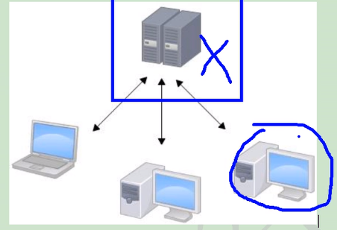
* **分布式**：git、Mercurial...(避免单点故障)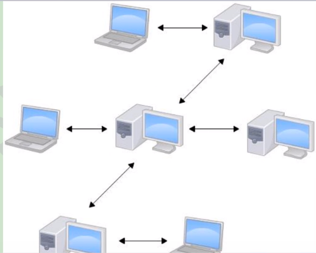

### 1.2 Git历史

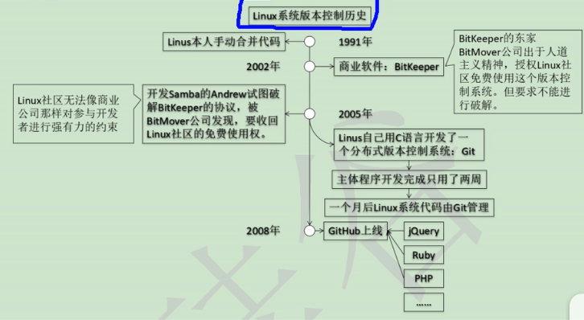

### 1.3 Git优势

* 大部分操作在本地完成
* 完整性保证(hash)
* 尽可能添加数据而不是删除或修改数据
* 分支操作流畅
* 与Linux命令兼容

### 1.4 Git安装

Windows: 安装到非中文无空格目录

Linux: pacman -S git

### 1.5 Git结构

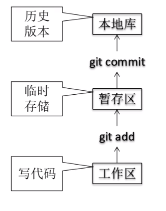

代码托管中心：维护远程库

### 1.6 本地库和远程库

团队内：

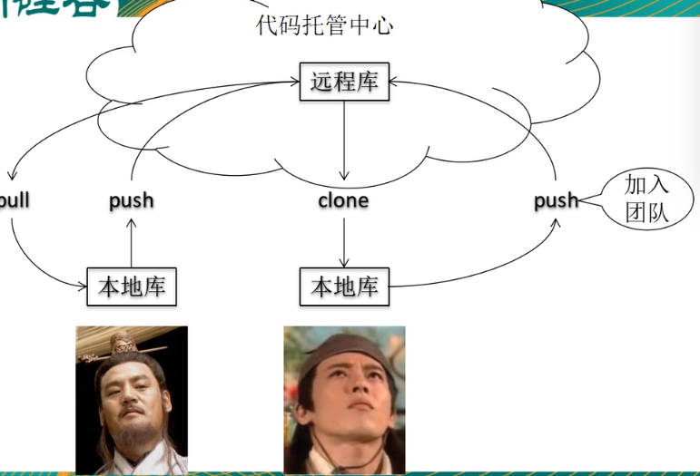

团队外：

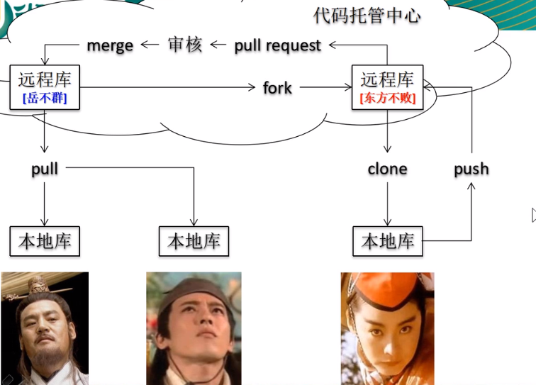

## 2. Git操作

### 2.1 本地库操作

#### a. 初始化仓库

```shell
git init # 生成一个空的git仓库 和 .git目录
```

.git目录中存放的是本地库相关的子目录和文件，不要删除和乱修改。

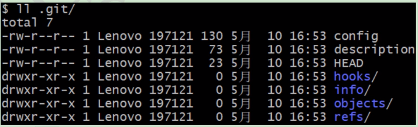

#### b.设置签名

```shell
# 区分不同开发人员的身份
# 方式
# 优先级：就近原则，项目的优先级优于系统级别
### 1. 项目级别/仓库级别
# 只对当前本地库范围生效
# 信息保存在 .git/config 文件
git config user.name _name_
git config user.email _mail@a.com
### 2. 系统用户级别
# 登录当前操作系统的用户范围
# 信息保存在 ~/.gitconfig 文件
git config --global user.name _name_
git config --global user.email _mail@a.com
```

**注意：**这里设置的签名和远程库*(github)的帐号密码没有任何关系

**当前仓库设置：**

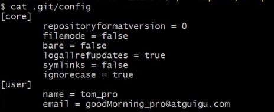

**系统设置：**

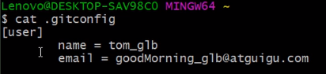

### 2.2 Git 常用命令

```shell
git status # 查看工作区、暂存区、本地库的状态
git add <file> # 将文件的新建或修改添加到暂存区
git rm --cached <file> # 将file从暂存区撤回(不会动工作区的文件)
git commit -m <message> # 将暂存区的文件提交到本地库
git checkout -- <file> # 撤销工作区的变化
git reset HEAD <file> # 
```

**版本的历史记录**

```shell
git log # 查看版本的记录 git log --pretty=oneline
# HEAD 是一个指针，指向当前的版本
git log --pretty=oneline # 更直观的查看
git log --oneline # hash值只显示一部分
git reflog # 相比log 多了commit信息，和HEAD的移动指针操作
```

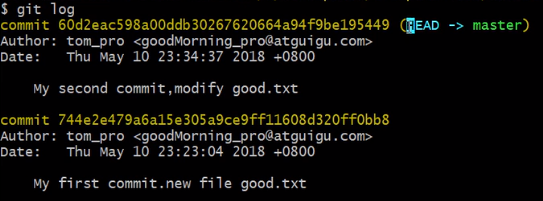

### **2.3 版本穿梭**

基于**HEAD**指针进行版本的前进或后退

* 基于索引值(**推荐**)

  ```shell
  git reset --hard $index # $index索引值即hash值
  ```

* 使用^符号：只能后退

  ```shell
  git reset --hard HEAD^ # 加一个 ^ 代表回退一步
  ```

* 使用~符号：只能后退

  ```shell
  git reset --hard HEAD~n # 后退n步
  ```

**reset的三个参数mixed、soft、hard的区别**

* --soft：仅仅在本地库移动head指针
* --mixed：在本地库移动head指针，重置暂存区
* --hard：在本地库移动head指针，重置暂存区，重置工作区

##### 恢复删除文件

```shell
# 前提：删除前，文件存在时的状态提交到了本地库
# 回退到文件存在的版本
git reset --hard [HEAD]
	# 删除操作已经提交到本地库，指针位置指向历史记录
	# 删除操作尚未提交到本地库，指针位置使用HEAD
```

**比较文件**

```shell
git diff <file> # 工作区和暂存区比较
git diff HEAD <file> # 工作区和本地库比较
git diff HEAD^ <file> # 工作区和某一个历史版本比较
# 不带文件名，比较多个文件
```

### 2.4 分支操作

```shell
git branch _name_ #  创建一个新的分支
git branch -v # 查看分支
git checkout _branch_name # 切换到 _branch_name分支
# 合并分支
  # 1. 切换到被合并的分支上
  git checkout master
  # 2. 执行merge命令(和哪个分支合并,有新内容的分支)
  git merge hot_fix # 将hot_fix分支的内容加到master内
  # 解决冲突(两个分支修改了同一个文件的同一行,git是以行为单位)
  	# 手工修改冲突文件
  	git add <file>
  	git commit -m # 注意，在这里不能带文件名
```

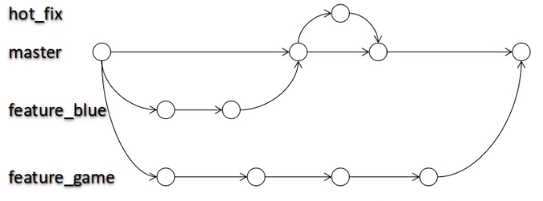


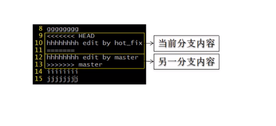

### 3. Github

**本地库和远程库的link**

```shell
# 创建**本地库和远程库的link**并给仓库起别名
git remote add origin(别名) 仓库地址
# 推送
git push origin(别名) master(分支)
```

**远程库到本地库**

```shell
git clone 仓库地址
# 克隆的三个效果
   # 1. 完整把远程库下载到本地
   # 2. 创建origin远程地址别名
   # 3. 初始化本地库
```

**邀请加入团队**

**远程库的拉取**

```shell
# 保险、慎重的操作
git fetch origin master(远程分支名) # 把远程库下载到本地库,并不对本地文件合并
git merge origin(远程地址别名)/master(远程分支名) # 合并远程库

# pull = fetch + merge
git pull origin(远程地址别名) master(远程分支名)
```

**冲突解决**

```shell
# 先拉取
git pull origin master
# 按照分支解决的办法解决冲突
 # 修改冲突文件
git add <file>
git commit -m '' # 不能加文件名
git push origin master # 推送到远程库
```

**SSH免密操作**

```shell
# 1. 将本机的公钥添加到github服务器
# 2. 添加远程库的SSH地址
git remote add origin_ssh ssh_address
# 3. 推送到 SSH地址
git push origin_ssh master
```

