# 0. 基础知识

## 0.1 一个Linux程序的诞生

```c++
// hello_world.c
#include <stdio.h>

int main() {
    printf("Hello World.");
    return 0;
}
```

通过GCC编译，就得到了一个应用程序。

当然，整个过程看似简单，其实是GCC工具集帮我们完成了许多步骤。具体的步骤包括：

* 预处理

  * 头文件包含：该头文件的所有代码会在#include处展开

  * 宏替换：展开宏定义(注：模板是在编译期生成代码)

  * 去掉注释：

  * 条件编译：不符合的会被删除，进不到编译阶段

    ```shell
    # 查看 预处理的结果
    gcc -E hello_world.c -o hello_world.i
    # 常见错误
    1. 为什么在头文件中不能定义变量？
    这是因为定义全局变量的代码会存在于所有以\#include包含该头文件的文件中，也就是说所有的这些文件，都会定义一个同样的全局变量，这样就不可避免地造成了冲突。
    ```

    

* 编译

  * 检查语法(语法分析)

  * 生成汇编

    ```shell
    # 查看编译结果
    gcc -S hello_world.i -o hello_world.s
    ```

    

* 汇编

  * 将源代码翻译成可执行的指令，并生成目标文件

    ```shell
    # 查看汇编结果
    gcc -C hello_world.s -o hello_world.o
    ```

    

* 链接

  * 将各个目标文件-包括库文件链接成一个可执行程序。在这个过程中涉及**地址和空间的分配**、**符号解析**、**重定位**等。
  * 工具：GNU的链接器ld

* ...

我们可以使用以下命令，查看完整的编译过程

```shell
gcc -g -Wall -v hello_world.c -o hello_world
```


## 0.2 程序的构成 

在Linux下，可执行程序的格式为ELF格式，我们可以使用`readelf`查看程序的ELF格式。

```shell
readelf hello_world
```

ELF文件的主要内容是由各个section和symbol表组成。

常见的段(section)包括：

* text段：代码段，用于保存可执行指令
* data段：数据段，用于保存有非0初始值的全局变量和静态变量
* bss段：用于保存没有初始值或初值为0的全局变量和静态变量，当程序加载时，bss段中的变量会被初始化为0。这个段并不占用物理空间
* debug段：用于保存调试信息，不使用-g选项，则不会生成
* dynamic段：用于保存动态链接信息
* rodata段：用于保存只读数据，如const修饰的常量、字符串变量等
* symbol段：用于保存符号表，使用strip可以去掉符号信息
* init段：用于保存进程启动时的执行程序。当进程启动时，系统会自动执行这部分代码。
* fini段：用于保存进程退出时的执行程序。当进程结束时，系统会自动执行这部分代码。

## 0.3 程序是如何跑起来的

在Linux系统下，我们可以使用`strace`跟踪系统调用，从而帮助自己研究和理解系统程序的加载、运行和退出的过程。

```shell
strace ./hello_world
```

在Linux环境下，该命令的过程：

* 由shell调用`fork`，在子进程中执行命令
* 调用`execve`加载hello_world，然后ld会分别检查ld.so.nohwcap和ld.so.preload。其中，如果ld.so.nohwcap存在，则ld会加载其中未优化版本的库。如果ld.so.preload存在，则ld会加载其中的库——在一些项目中，我们需要拦截或替换系统调用或C库，此时就会利用这个机制，使用LD_PRELOAD来实现。
* 利用mmap将ld.so.cache映射到内存中，ld.so.cache中保存了库的路径，这样就完成了所有的准备工作。
* 接着ld加载c库——libc.so.6，利用mmap及mprotect设置程序的各个内存区域，到这里，程序运行的环境已经完成。
* write会向文件描述符1（即标准输出）输出"Hello world！\n"，返回值为13，它表示write成功的字符个数。
* 最后调用exit_group退出程序，此时参数为0，表示程序退出的状态——此例中hello-world程序返回0

## 0.4 系统调用

系统调用是操作系统提供的服务，是应用程序和内核通信的接口。相对于普通函数，系统调用的消耗是巨大的。用户空间的程序默认是通过栈来传递参数的。对于系统调用来说，**内核态和用户态使用的是不同的栈**，这使得**系统调用的参数只能通过寄存器的方式进行传递**。

## 0.5 线程安全

线程安全即程序在多线程环境下能够“安全”的执行，也即符合正确的逻辑结果。

为了实现线程安全，要么只能使用局部变量或资源，要么利用锁等同步机制，实现全局变量或资源的串行访问。

## 0.6 原子性

以前原子被认为是物理组成的最小单元，所以在计算机领域，就借其不可分割的这层含义作为隐喻。对于计算机科学来说，如果变量是原子的，那么对这个变量的任何访问和更改都是原子的。如果操作是原子的，那么这个操作将是不可分割的，要么成功，要么失败，不会有任何的中间状态。

## 0.7 可重入函数

从字面上理解，可重入就是可重复进入。在编程领域，它不仅仅意味着可以重复进入，还要求在进入后能成功执行。这里的重复进入，是指当前进程已经处于该函数中，这时程序会允许当前进程的某个执行流程再次进入该函数，而不会引发问题。这里的执行流程不仅仅包括多线程，还包括信号处理、longjump等执行流程。所以，可重入函数一定是线程安全的，而线程安全函数则不一定是可重入函数。从以上定义来看，很难说出哪些函数是可重入函数，但是可以很明显看出哪些函数是不可以重入的函数。当函数使用锁的时候，尤其是互斥锁的时候，该函数是不可重入的，否则会造成死锁。若函数使用了静态变量，并且其工作依赖于这个静态变量时，该函数也是不可重入的，否则会造成该函数工作不正常。

## 0.8 阻塞和同步

这里的阻塞与非阻塞，都是指I/O操作。在Linux环境下，所有的I/O系统调用默认都是阻塞的。那么何谓阻塞呢？阻塞的系统调用是指，当进行系统调用时，除非出错（被信号打断也视为出错），进程将会一直陷入内核态直到调用完成。非阻塞的系统调用是指无论I/O操作成功与否，调用都会立刻返回。

这里的同步与非同步，也是指I/O操作。当把阻塞、非阻塞、同步和非同步放在一起时，不免会让人眼花缭乱。同步是否就是阻塞，非同步是否就是非阻塞呢？实际上在I/O操作中，它们是不同的概念。同步既可以是阻塞的，也可以是非阻塞的，而常用的Linux的I/O调用实际上都是同步的。这里的同步和非同步，是指I/O数据的复制工作是否同步执行。以系统调用read为例。阻塞的read会一直陷入内核态直到read返回；而非阻塞的read在数据未准备好的情况下，会直接返回错误，而当有数据时，非阻塞的read同样会一直陷入内核态，直到read完成。这个read就是同步的操作，即I/O的完成是在当前执行流程下同步完成的。如果是非同步即异步，则I/O操作不是随系统调用同步完成的。调用返回后，I/O操作并没有完成，而是由操作系统或者某个线程负责真正的I/O操作，等完成后通知原来的线程。

# 1. 文件IO

## 1.1.1 文件、文件描述符和文件表

Linux内核**将一切都视为文件**，在Linux中，文件既可以是传统上的物理文件，也可以是设备、管道甚至一块内存。这些文件**利用VFS机制，以文件系统的形式挂载在Linux内核中**，**对外提供一致的接口**。

从数值上看，**文件描述符是一个非负整数，其本质就是一个句柄**，所以也可以认为文件描述符就是一个文件句柄。那么何为句柄呢？一切对于用户透明的返回值，即可视为句柄。**用户空间利用文件描述符与内核进行交互；而内核拿到文件描述符后，可以通过它得到用于管理文件的真正的数据结构**。使用文件描述符即句柄，有两个好处：一是增加了安全性，句柄类型对用户完全透明，用户无法通过任何hacking的方式，更改句柄对应的内部结果，比如Linux内核的文件描述符，只有内核才能通过该值得到对应的文件结构；二是增加了可扩展性，用户的代码只依赖于句柄的值，这样实际结构的类型就可以随时发生变化，与句柄的映射关系也可以随时改变，这些变化都不会影响任何现有的用户代码。

**Linux的每个进程都会维护一个文件表，以便维护该进程打开文件的信息，包括打开的文件个数、每个打开文件的偏移量等信息**。

**文件表的实现**

内核中进程对应的结构是file_struct，进程中的文件表保存在file_struct->files中，其代码结构如下：

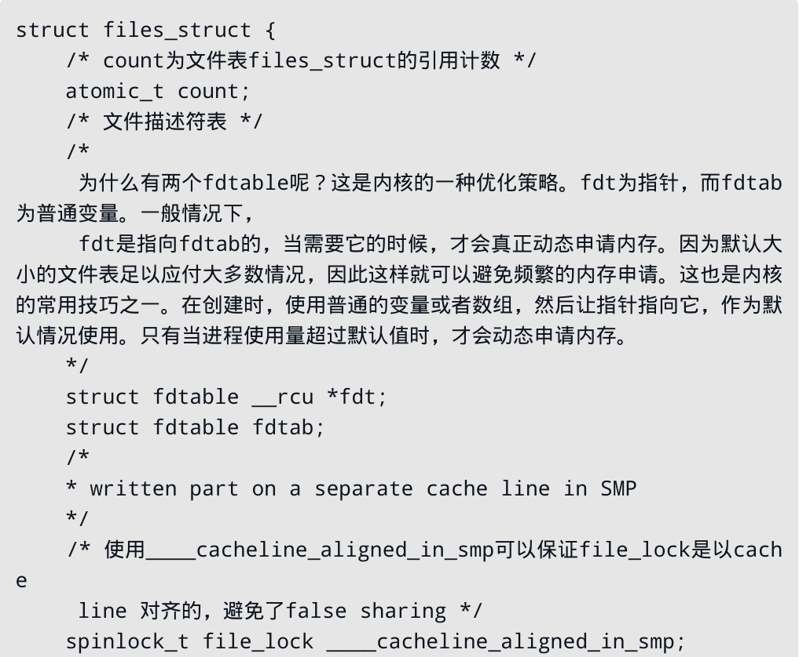

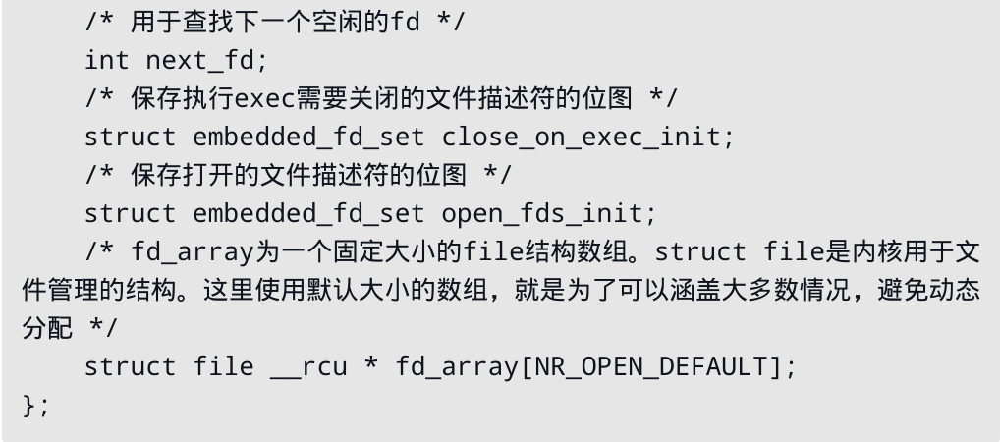

下面看看files_struct是如何使用默认的fdtab和fd_array的，init是Linux的第一个进程，它的文件表是一个全局变量，代码如下：

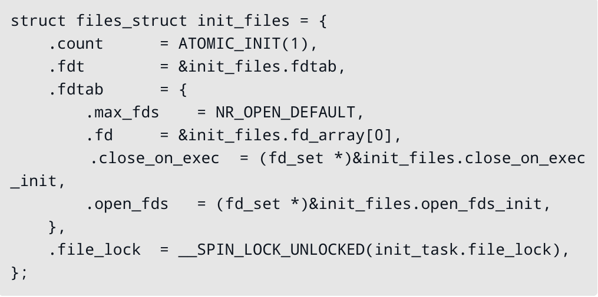

因此，初始状态下，files_struct、fdtable和files的关系如图1-1所示。

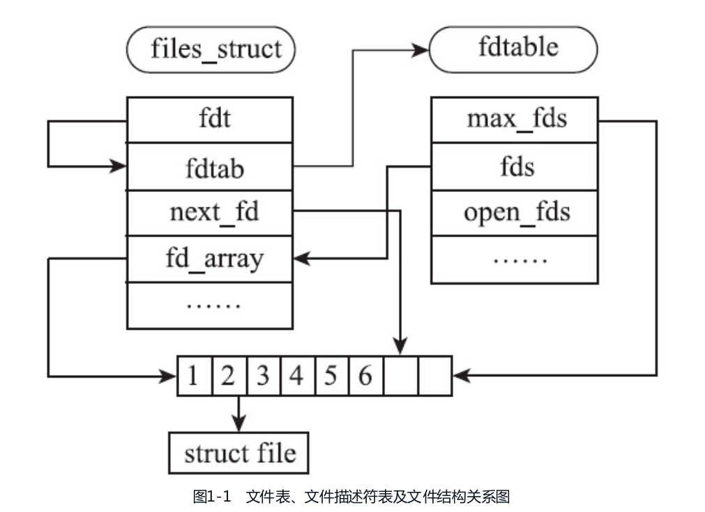

## 1.2 打开文件

#### open介绍

open的函数原型：

```c++
int open(const char *pathname, int flags);
int open(const char *pathname, int flags, mode_t mode);
```

* pathname: 要打开的文件路径
* flags：用于指示打开文件的选项。常用的有O_RDONLY、O_WRONLY和O_RDWR。这三个选项必须有且只能有一个被指定。
* mode：只在创建文件时需要，用于指定所创建文件的权限位（还要受到umask环境变量的影响）。

当我们调用open函数时，实际上调用的是glibc封装的函数，然后由glibc通过自陷指令，进行真正的系统调用。也就是说，所有的系统调用都要先经过glibc才会进入操作系统。这样的话，实际上是glibc提供了一个变参函数open来满足两个函数原型，然后通过glibc的变参函数open实现真正的系统调用来调用原型二。

#### open源码

我们经常这样描述“打开一个文件”，那么这个所谓的“打开”，究竟“打开”了什么？内核在这个过程中，又做了哪些事情呢？这一切将通过分析内核源码来得到答案。跟踪内核open源码**open->do_sys_open**，代码如下：

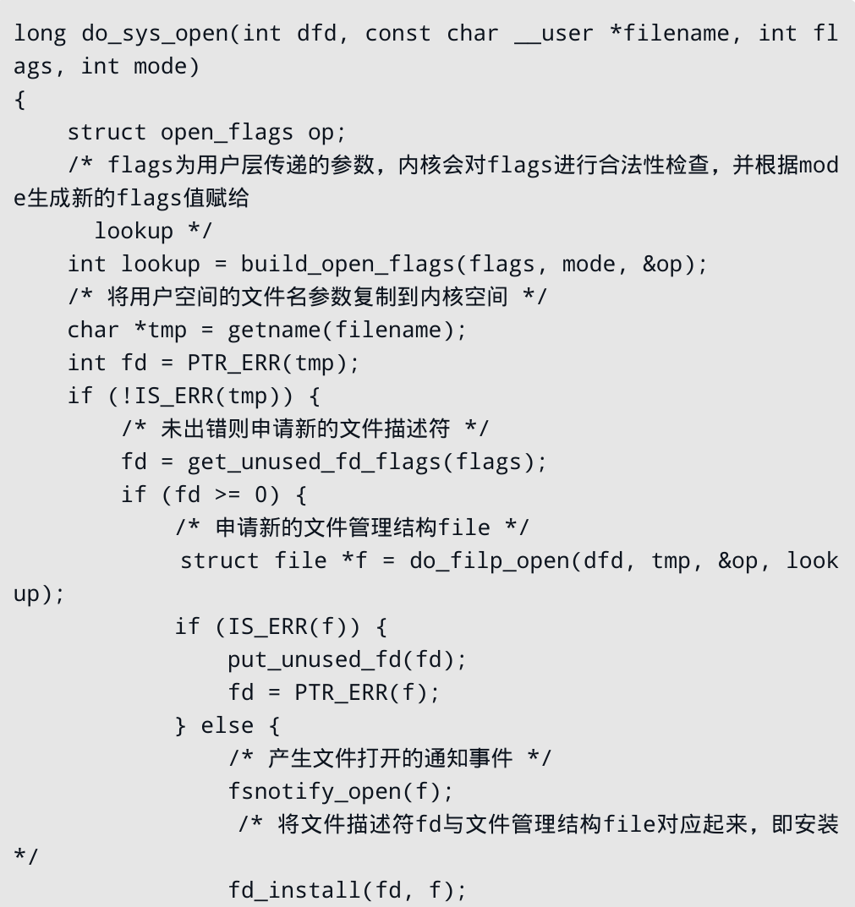


从do_sys_open可以看出，打开文件时，内核主要消耗了两种资源：**文件描述符与内核管理文件结构file。**

#### 如何选择文件描述符

根据POSIX标准，当获取一个新的文件描述符时，要返回最低的未使用的文件描述符。Linux是如何实现这一标准的呢？在Linux中，通过do_sys_open->get_unused_fd_flags->alloc_fd（0，（flags））来选择文件描述符，代码如下：

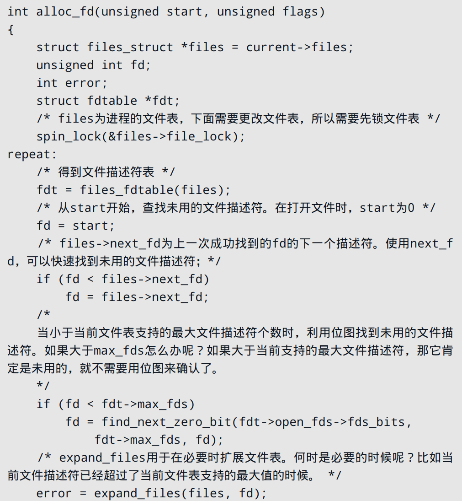

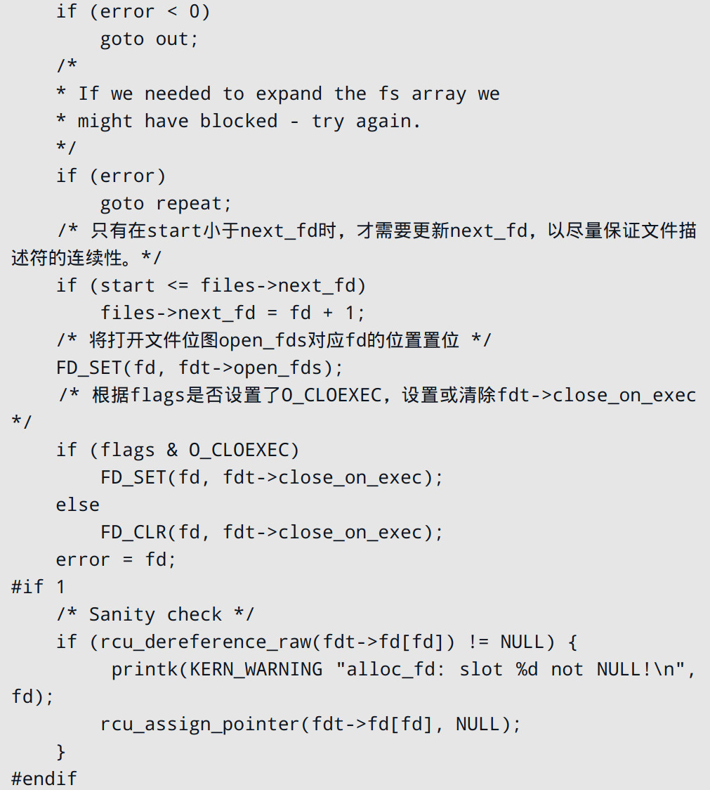

#### 文件描述符fd与文件管理结构file

前文已经说过，内核使用fd_install将文件管理结构file与fd组合起来，具体操作请看如下代码：

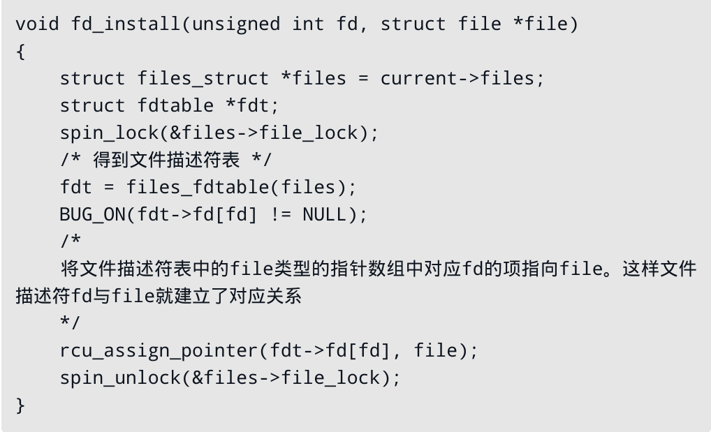

当用户使用fd与内核交互时，内核可以用fd从fdt->fd[fd]中得到内部管理文件的结构struct file。

## 1.3 creat简介

creat函数用于创建一个新文件，其等价于open（pathname，O_WRONLY|O_CREAT|O_TRUNC，mode）。APUE介绍了引入creat的原因：由于历史原因，早期的Unix版本中，open的第二个参数只能是0、1或者2。这样就没有办法打开一个不存在的文件。因此，一个独立系统调用creat被引入，用于创建新文件。现在的open函数，通过使用O_CREAT和O_TRUNC选项，可以实现creat的功能，因此creat已经不是必要的了。

creat无非是open的一种封装实现。


## 1.4 close

close用于关闭文件描述符。而文件描述符可以是普通文件，也可以是设备，还可以是socket。在关闭时，VFS会根据不同的文件类型，执行不同的操作。

#### close源码追踪

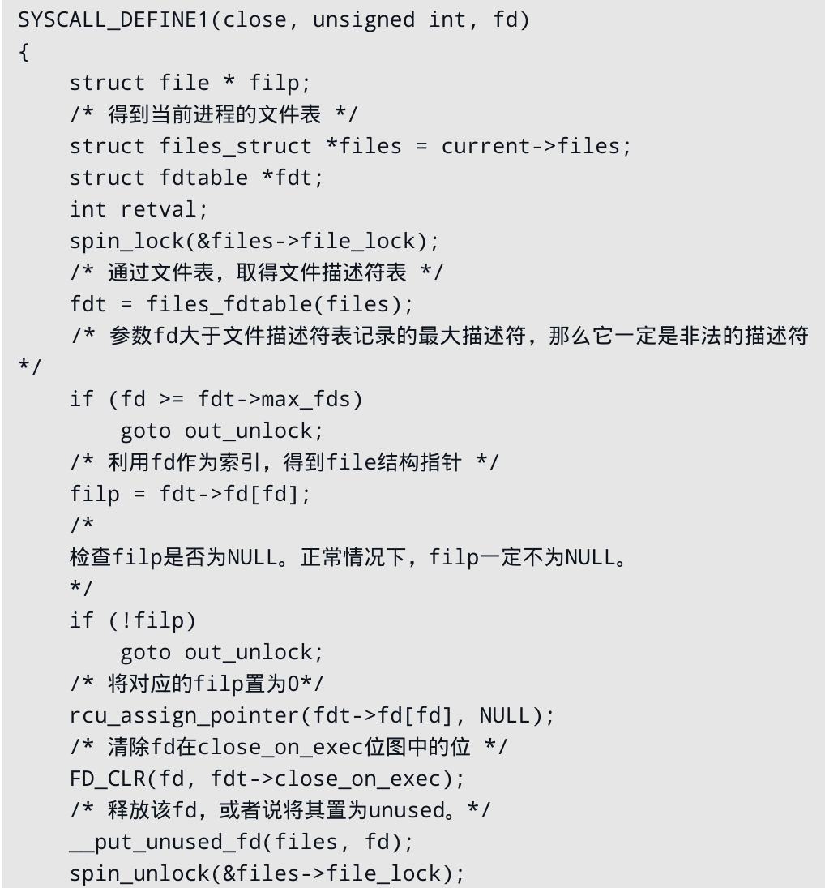

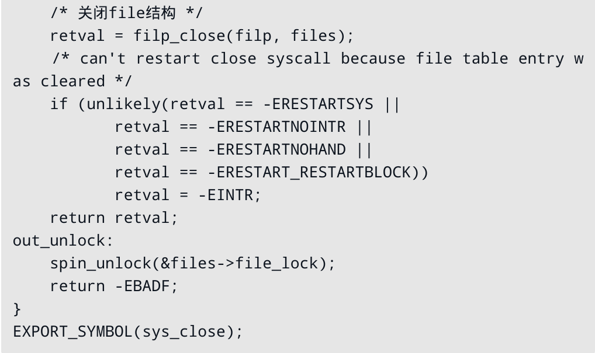

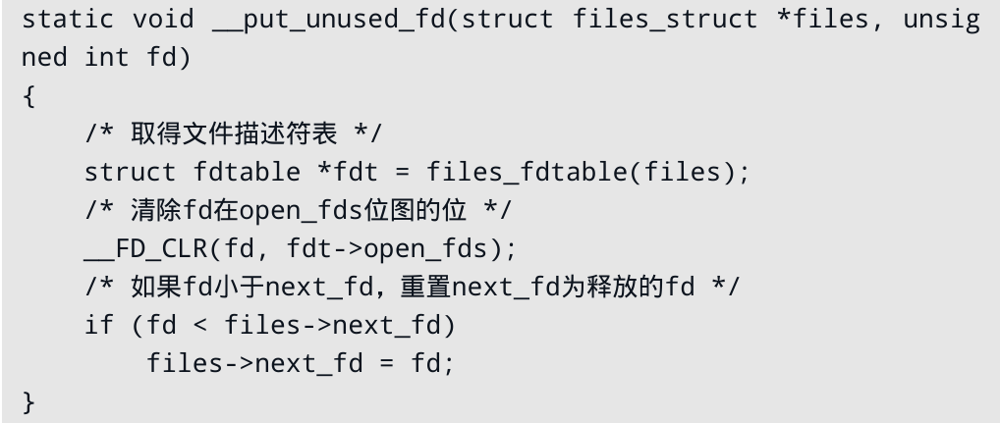

完整的Linux文件描述符选择策略：

* Linux选择文件描述符是按从小到大的顺序进行寻找的，文件表中next_fd用于记录下一次开始寻找的起点。当有空闲的描述符时，即可分配。
* 当某个文件描述符关闭时，如果其小于next_fd，则next_fd就重置为这个描述符，这样下一次分配就会立刻重用这个文件描述符。

从____put_unused_fd退出后，close会接着调用filp_close，其调用路径为filp_close->fput。在fput中，会对当前文件struct file的引用计数减一并检查其值是否为0。当引用计数为0时，表示该struct file没有被其他人使用，则可以调用__fput执行真正的文件释放操作，然后调用要关闭文件所属文件系统的release函数，从而实现针对不同的文件类型来执行不同的关闭操作

#### 自定义files_operations

这里也选择socket文件系统作为示例，来说明Linux如何挂载文件系统指定的文件操作函数files_operations。socket.c中定义了其文件操作函数file_operations，代码如下：

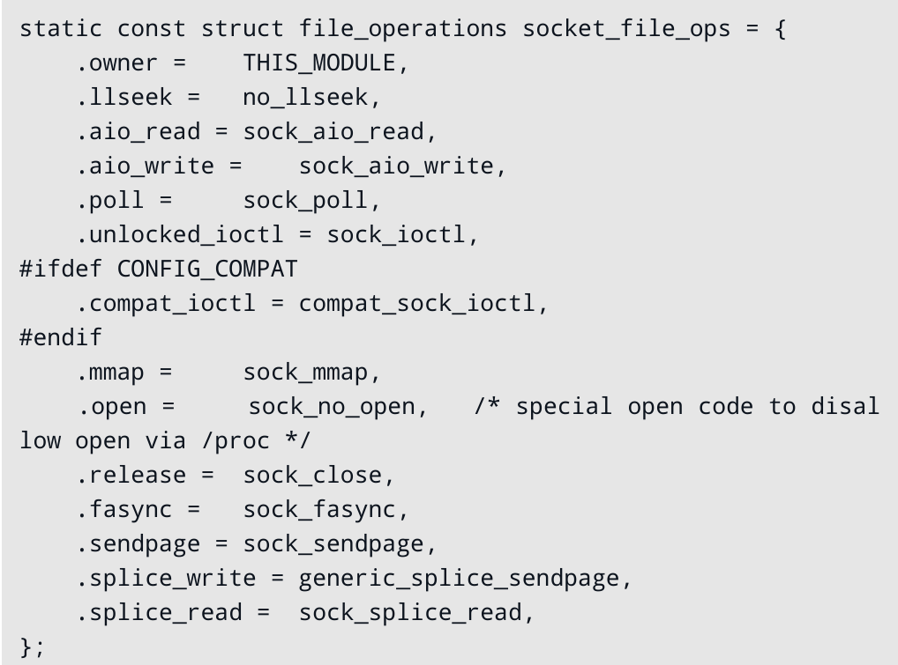

函数sock_alloc_file用于申请socket文件描述符及文件管理结构file结构。它调用alloc_file来申请管理结构file，并将socket_file_ops作为参数，

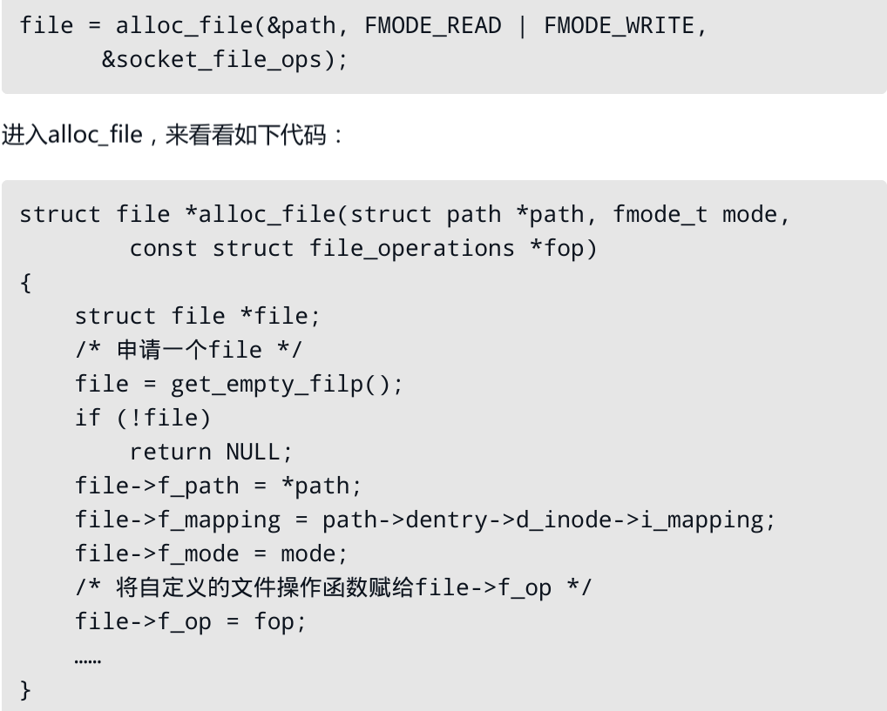

在初始化file结构的时候，socket文件系统将其自定义的文件操作赋给了file->f_op，从而实现了在VFS中可以调用socket文件系统自定义的操作。

#### 遗忘close造成的问题

* 文件描述符始终没有被释放。如果文件描述符没有被释放，那么再次申请新的描述符时，就不得不扩展当前的文件表了.从上面的代码可以看出，在扩展文件表的时候，会检查打开文件的个数是否超出系统的限制。如果文件描述符始终不释放，其个数迟早会到达上限，并返回EMFILE错误（表示Too many open files（POSIX.1））
* 用于文件管理的某些内存结构没有被释放。

#### 如何查找文件资源泄漏

```shell
lsof -p PID # 从/proc/PID/fd中也可以得到类似的结果
```

## 1.5 文件偏移

文件偏移是基于某个打开文件来说的，一般情况下，读写操作都会从当前的偏移位置开始读写（所以read和write都没有显式地传入偏移量），并且在读写结束后更新偏移量

lseek的原型如下：

```c
off_t lseek(int fd, off_t offset, int whence);
// 将fd的文件偏移量设置为以whence为起点，偏移为offset的位置
```

whence:

* SEEK_SET：文件的起始位置
* SEEK_CUR：文件的当前位置
* SEEK_END：文件的末尾

而offset的取值正负均可。lseek执行成功后，会返回新的文件偏移量。

#### lseek的返回值

当lseek执行成功时，它会返回最终**以文件起始位置为起点的偏移位置**。如果**出错，则返回-1**，同时errno被设置为对应的错误值。

> 对于普通文件来说，lseek都是返回非负的整数，但是对于某些设备文件来说，是允许返回负的偏移量。因此要想判断lseek是否真正出错，必须在调用lseek前将errno重置为0，然后再调用lseek，同时检查返回值是否为-1及errno的值。只有当两个同时成立时，才表明lseek真正出错了。

## 1.6 读取文件

read的函数原型如下：

```c
size_t read(int fd, void *buf, size_t cout);
```

read尝试从fd中**读取count个字节到buf中**，并**返回成功读取的字节数**，同时将**文件偏移向前移动相同的字节数**。**返回0的时候则表示已经到了“文件尾**”。read还有可能读取比count小的字节数。使用read进行数据读取时，要注意正确地处理错误，也是说read返回-1时，如果errno为EAGAIN、EWOULDBLOCK或EINTR，一般情况下都不能将其视为错误。因为前两者是由于当前fd为非阻塞且没有可读数据时返回的，后者是由于read被信号中断所造成的。这两种情况基本上都可以视为正常情况。

#### read源码

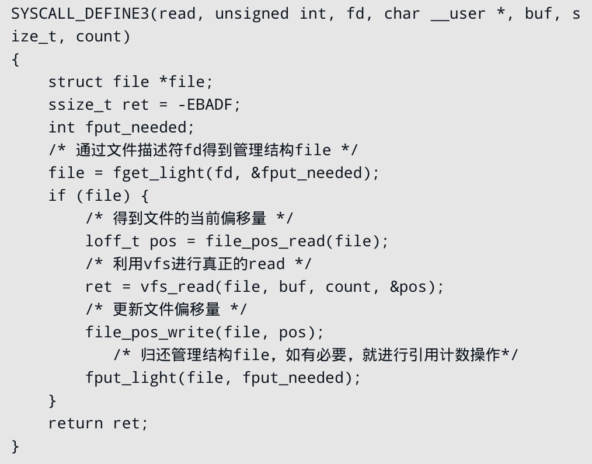

再进入vfs_read

## 1.7 写入文件

Linux中写入文件操作，最常用的就是write函数，其原型如下：

```c
size_t write(int fd, const void *buf, size_t count);
```

write尝试从buf指向的地址，写入count个字节到文件描述符fd中，并返回成功写入的字节数，同时将文件偏移向前移动相同的字节数。write有可能写入比指定count少的字节数。

#### wirte源码

write的源码与read的很相似，位于read_write.c中，代码如下：

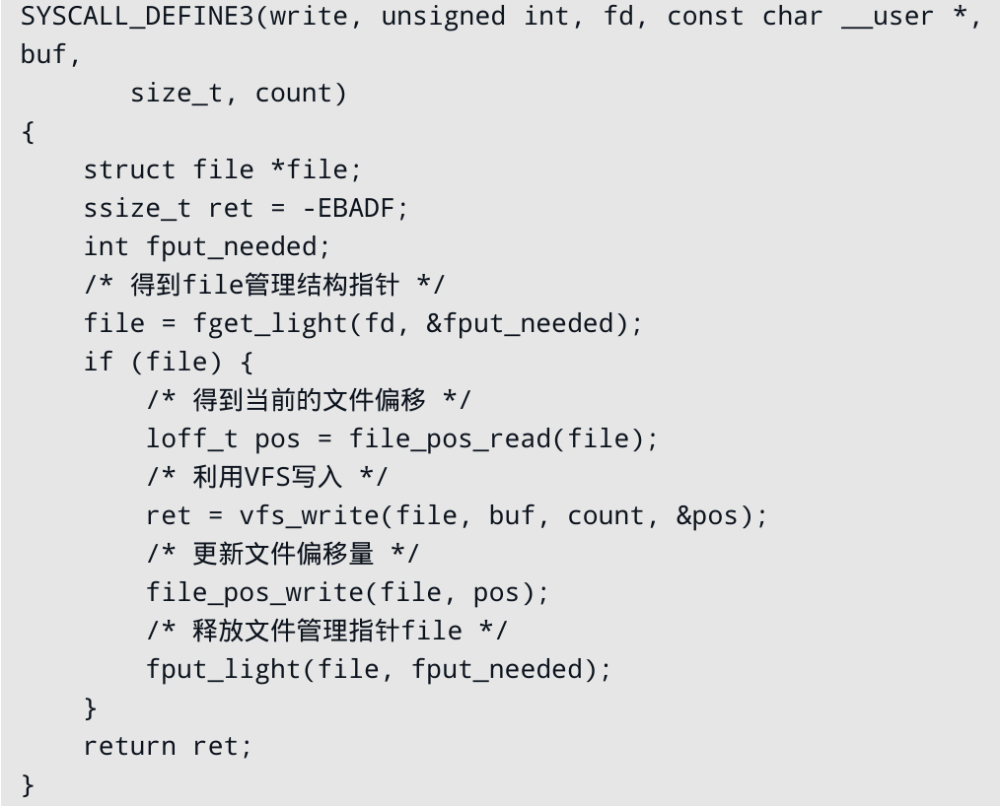

进入vfs_write，代码如下：

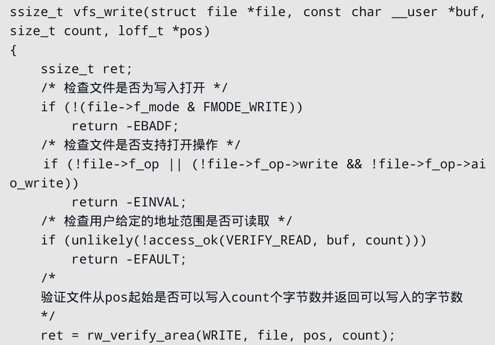

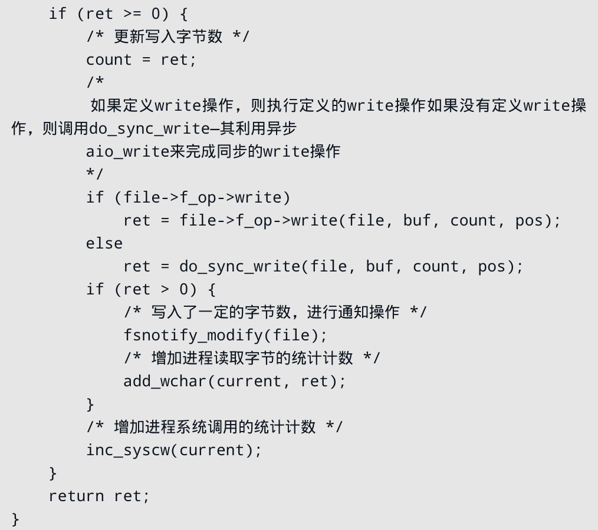


文件的**读写操作都是从当前文件的偏移处开始的**。这个文件偏移量保存在文件表中，而每个进程都有一个文件表。那么当多个进程同时写一个文件时，即使对write进行了锁保护，在进行串行写操作时，文件依然不可避免地会被写乱。根本原因就在于**文件偏移量是进程级别**的。

当使用O_APPEND以追加的形式来打开文件时，每次写操作都会先定位到文件末尾，然后再执行写操作。Linux下大多数文件系统都是调用generic_file_aio_write来实现写操作的。在generic_file_aio_write中，有如下代码：


使用mutex_lock对该文件对应的inode进行保护，然后调用__generic_file_aio_write->generic_write_check


如果发现文件是以追加方式打开的，则将从inode中读取到的最新文件大小作为偏移量，然后通过__generic_file_aio_write再进行写操作，这样就能保证写操作是在文件末尾追加的。

使用O_APPEND可以实现在文件的末尾原子追加新数据，Linux还提供**pread和pwrite从指定偏移位置读取或写入数据**。

这就是它与read的主要区别。**pread不会从文件表中获取当前偏移，而是直接使用用户传递的偏移量，并且在读取完毕后，不会更改当前文件的偏移量**。

## 1.8文件数据的同步

为了提高性能，**操作系统会对文件的I/O操作进行缓存处理**。对于读操作，如果要读取的内容已经存在于文件缓存中，就直接读取文件缓存。**对于写操作，会先将修改提交到文件缓存中，在合适的时机或者过一段时间后，操作系统才会将改动提交到磁盘上**。

Linux提供了三种同步函数：

```c
void sync(void); // Linux的sync是阻塞调用
/* fsync只同步fd指定的文件，并且直到同步完成才返回
fsync不仅同步数据，还会同步所有被修改过的文件元数据
*/
int fsync(int fd);
// 只同步文件的实际数据内容，不会影响后面数据操作的元数据
int fdatasync(int fd);
```

> sync、fsync和fdatasync只能保证Linux内核对文件的缓冲被冲刷了，并不能保证数据被真正写到磁盘上，因为磁盘也有自己的缓存。

## 1.9 文件的元数据

什么是文件的元数据呢？其包括**文件的访问权限**、**上次访问的时间戳**、**所有者**、**所有组**、**文件大小**等信息。

#### 获取文件的元数据

Linux提供了三种获取文件信息的API：

```c
#include <sys/types.h>
#include <sys/stat.h>
#include <unistd.h>

int stat(const char *path, struct stat *buf);
int fstat(int fd, struct stat *buf);
int lstat(const char *path, struct stat *buf);
```

区别在于**stat得到路径path所指定的文件基本信息**，**fstat得到文件描述符fd指定文件的基本信息**，而**lstat与stat则基本相同，只有当path是一个链接文件时，lstat得到的是链接文件自己本身的基本信息**而不是其指向文件的信息。

struct stat的结构如下：

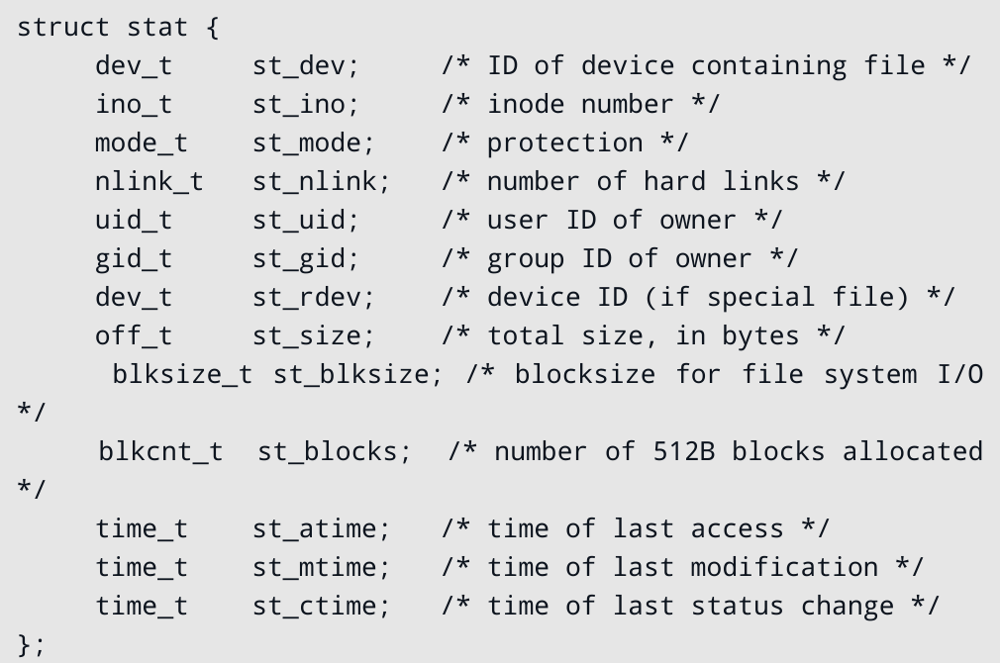

需要注意的是，**st_mode，其不仅仅是注释所说的“protection”，即权限管理，同时也用于表示文件类型，比如是普通文件还是目录**。

所有的**文件元数据均保存在inode中**，而inode是Linux也是所有类Unix文件系统中的一个概念。这样的文件系统一般将**存储区域分为两类**，一类是保存文件对象的元信息数据，即**inode表**；另一类是**真正保存文件数据内容的块**，所有inode完全由文件系统来维护。但是Linux也可以挂载非类Unix的文件系统，这些文件系统本身没有inode的概念，怎么办？Linux为了让VFS有统一的处理流程和方法，就必须要求那些没有inode概念的文件系统，根据自己系统的特点——如何维护文件元数据，生成“虚拟的”inode以供Linux内核使用。

#### 特殊的权限位

* SUID：当文件设置SUID权限位时，就意味着无论是谁执行这个文件，都会拥有该文件所有者的权限。passwd命令正是利用这个特性，来允许普通用户修改自己的密码，因为只有root用户才有修改密码文件的权限。当普通用户执行passwd命令时，就具有了root权限，从而可以修改自己的密码。
* SGID： SGID与SUID权限位类似，当设置该权限位时，就意味着无论是谁执行该文件，都会拥有该文件所有者所在组的权限。
* Stricky位：Stricky位只有配置在目录上才有意义。当目录配置上sticky位时，其效果是即使所有的用户都拥有写权限和执行权限，该目录下的文件也只能被root或文件所有者删除。

> 可以使用chmod来设置文件或目录的权限。

## 1.10 文件截断

API：

```c
#include <unistd.h>
#include <sys/types.h>

int truncate(const char *path, off_t length);
int ftruncate(int fd, off_t lenght)；
```

区别在于，truncate截断的是路径path指定的文件，ftruncate截断的是fd引用的文件。

注：“截断”给人的感觉是将文件变短，即将文件大小缩短至length长度。实际上，**length可以大于文件本身的大小**，这时文件长度将变为length的大小，**扩充的内容均被填充为0**。需要注意的是，**尽管ftruncate使用的是文件描述符，但是其并不会更新当前文件的偏移。**

文件截断时允许指定比原有文件长度更长的值，但更常见的是指定的长度比原有长度短，这**主要用于防止文件内容混杂了旧内容的情况**。

当不使用文件截断而导致新旧数据混杂在一起时，定位错误将更加困难。所以，在我们的日常编码中，在写入文件，**如果并不需要旧数据，那么在打开文件时就要强制截断文件**，来提高代码的健壮性。

# 2. 标准IO

## 2.1 stdin、stdout和stderr

当Linux新建一个进程时，**会自动创建3个文件描述符0、1和2，分别对应标准输入、标准输出和错误输出。**C库中与文件描述符对应的是文件指针，与文件描述符0、1和2类似，我们可以直接使用文件指针stdin、stdout和stderr。

#### 源码

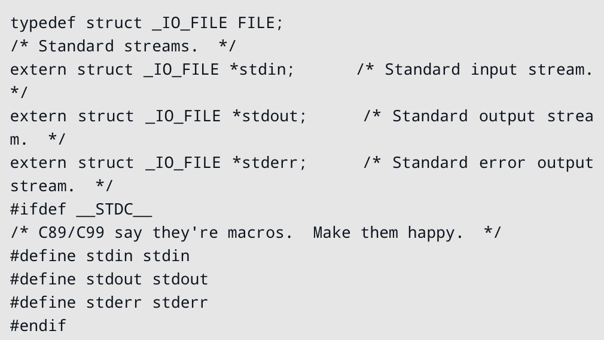


DEF_STDFILE是一个宏定义，用于初始化C库中的FILE结构。这里_IO_2_1_stdin、_IO_2_1_stdout和_IO_2_1_stderr这三个FILE结构分别用于文件描述符0、1和2的初始化，这样C库的文件指针就与系统的文件描述符互相关联起来了。大家注意最后的标志位，stdin是不可写的，stdout是不可读的，而stderr不仅不可读，且没有缓存。

stdin、stdout和stderr都是FILE类型的文件指针，是由C库静态定义的，直接与文件描述符0、1和2相关联，所以应用程序可以直接使用它们。

#### IO缓存

C库的I/O接口对文件I/O进行了封装，为了提高性能，其引入了缓存机制，共有三种缓存机制：全缓存、行缓存及无缓存。

* 全缓存：一般用于访问真正的磁盘文件。C库会为文件访问申请一块内存，只有当文件内容将缓存填满或执行冲刷函数flush时，C库才会将缓存内容写入内核中。
* 行缓存：一般用于访问终端。当遇到一个换行符时，就会引发真正的I/O操作。需要注意的是，C库的行缓存也是固定大小的。因此，当缓存已满，即使没有换行符时也会引发I/O操作。
* 无缓存：C库没有进行任何的缓存。任何C库的I/O调用都会引发实际的I/O操作。

#### fopen和open 的标志位

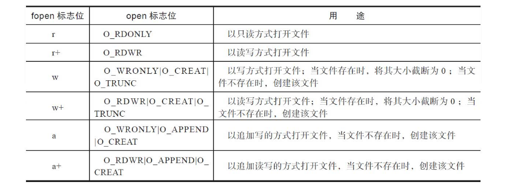


## 2.2 fdopen与fileno

Linux提供了文件描述符，而C库又提供了文件流。在平时的工作中，有时候需要在两者之间进行切换，因此C库提供了两个API：

```c
#include <stdio.h>
// 从文件描述符fd生成一个文件流FILE
// 创建一个新的文件流FILE，并建立文件流FILE与描述符的对应关系
FILE *fdopen(int fd, const char *mode);

// 从文件流FILE得到对应的文件描述符
// 文件流FILE保存了文件描述符的值。当从文件流转换到文件描述符时，可以直接通过当前FILE保存的值_fileno得到fd。
int fileno(FILE *stream);
```

因此无论是fdopen还是fileno，关闭文件时，都要使用fclose来关闭文件，而不是用close。因为只有采用此方式，fclose作为C库函数，才会释放文件流FILE占用的内存。

## 2.3 ferror的返回值

ferror用于告诉用户C库的文件流FILE是否有错误发生。当有错误发生时，ferror返回非零值，反之则返回0。

返回值有两种：

* 当文件流FILE* fp非法时，返回EOF（-1）。
* 当文件流FILE* fp前面的操作发生错误时，返回1。

#### 源码

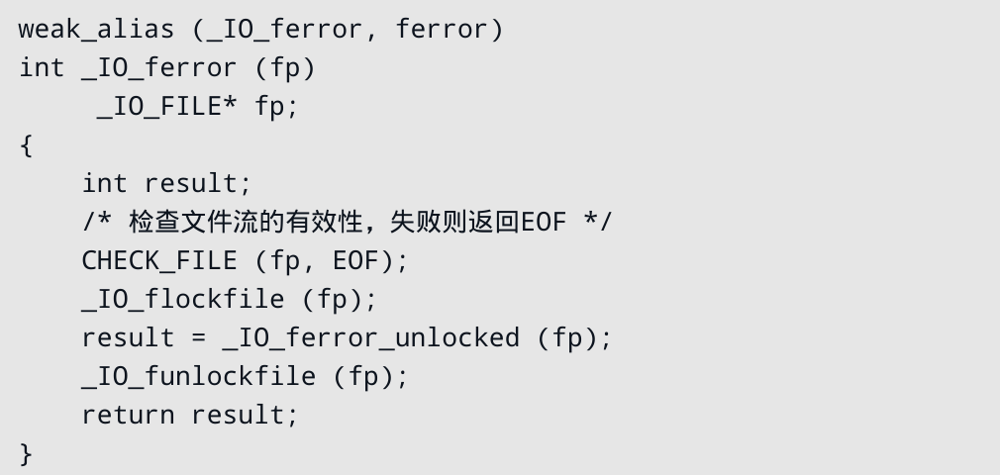


由于文件流的错误只是使用一个标志位_IO_ERR_SEEN来表示的，因此ferror的返回值就不可能针对不同的错误返回不同的值了。

#### clearerr

ferror用于检测文件流是否有错误发生，而clearerr用于清除文件流的文件结束位和错误位。

当文件流读到文件尾时，文件流会被设置上EOF标志。如果不使用clearerr清除EOF标志，即使有新的数据，也无法读取成功。

## 2.4 fgetc和getc

接口：

```c
#include <stdio.h>

int fgetc(FILE *stream);
int getc(FILE *stream);
```

注意：**两者的返回值都是int类型**。

为什么要用int类型作为返回值呢？因为当文件流读到文件尾时，需要返回EOF值。C99标准中规定了EOF为一个int类型的负数常量，并没有规定具体的值。

## 2.5 fread和fwrite

接口：

```c
#include <stdio.h>
size_t fread(void *ptr, size_t size, size_t nmemb, FILE *stream);
size_t fwrite(const void *ptr, size_t size, size_t nmemb, FILE *stream);
```

这两个函数原型很容易让人产生误解。当看到返回值类型为size_t时，人们很有可能理解为fread和fwrite会返回成功读取或写入的字节数，然而实际上其返回的是成功读取或写入的个数，即有多少个size大小的对象被成功读取或写入了。而参数nmemb则用于指示fread或fwrite要执行的对象个数。

# 3. 进程环境

进程是操作系统运行程序的一个实例，也是操作系统分配资源的单位。在Linux环境中，每个进程都有独立的进程空间，以便对不同的进程进行隔离，使之不会互相影响。深入理解Linux下的进程环境，可以帮助我们写出更健壮的代码。

