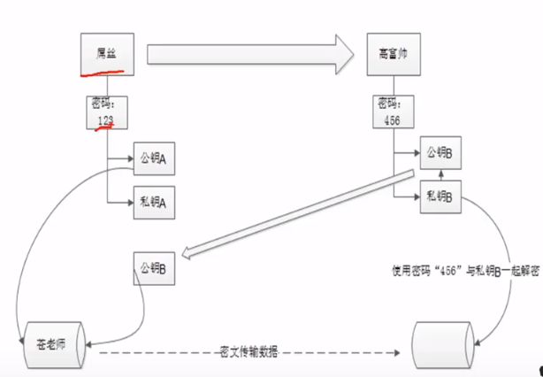
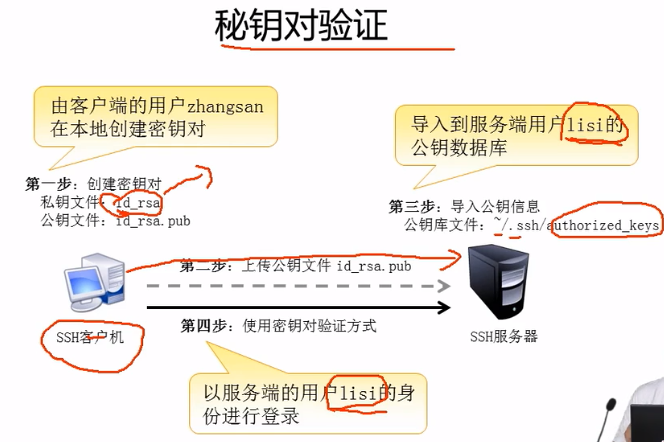
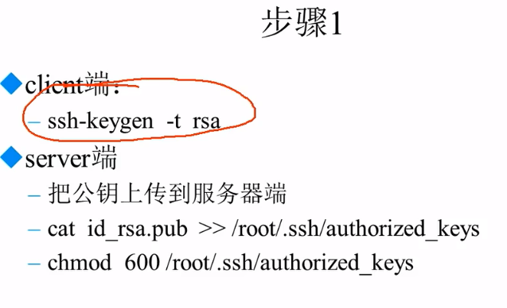

## 1. SSH简介

ssh(Secure Shell)是一款远程管理服务协议，建立在 应用层和传输层之上的协议。

早期Client到Server的管理工具 telnet在数据传输中是明文的，而ssh在传输之前会对数据包进行加密。

以ftp为例子：

```shell
# 监听 ftp端口 21 eth0指网卡， -nnX 指将数据包以16进制的方式显示
tcpdump -i eth0 -nnX port 21
# 而后在远程使用ftp连接
ftp *.*.*.*
# 在服务器端可以看到 传输的用户名和密码
```

ssh端口号: 22

Linux 中守护进程：sshd

```shell
# 在Linux中是默认启动的
ps aux | grep sshd
netstat -tlun | grep 22
```


安装服务：OpenSSH

服务端主程序：/usr/sbin/sshd

客户端主程序：/usr/bin/ssh

服务端 配置文件：/etc/ssh/sshd_config

客户端 配置文件：/etc/ssh/ssh_config

## 2. SSH加密原理

对称加密方式： 采用单匙密码系统的加密方法，同一个密匙可以同时用作信息的加密和解密。


非对称加密：又名“公开密匙加密算法”，非对称加密算法需要两个密匙：公开密匙（publickey）和私有密匙（privatekey）。



可以把公钥想象成锁，私钥想象成钥匙。如果需要共享，则把对方的公钥和自己的公钥来对数据进行加密，这样对方使用其私钥加密码可以访问数据，自己也可以通过自己的私钥和密码访问数据，不需要知道对方的密码。


在首次访问服务器时会下载服务器的公钥到本地，在之后的本地向服务器传送的数据会**使用公钥进行加密**，服务器在接受到数据后使用**私钥对数据进行解密**。


注意，**ssh保护的仅仅是在网络传输中的安全**，如果本机在传输之前就已经中了木马，在传输过程中再安全也没有意义。

## 3. SSH配置文件

服务端 配置文件：/etc/ssh/sshd_config

客户端 配置文件：/etc/ssh/ssh_config

Linux在使用过程中既是一个SSH服务端，也是一个SSH客户端。


GSSAPI(默认开启)需要DNS验证，使得登录异常缓慢，所以一般需要关闭(客户端文件)。


PermitRootLogin一般设置为No，通过普通用户登录。更安全的方式是使用公钥对验证。

PasswordAuthentication一般也设置为No，公钥验证登录。**切记要在公钥对验证开启之前。**

## 4. SSH常用命令

* ssh username@ip
* scp username@ip:/path path 下载 scp root@192.168.44.2:/root/test.txt **.**
* scp -r path username@ip/path 上传 scp -r /root/123 root@192.168.44.2:/root


## 5. SSH连接工具

* SecureCRT 收费
* XShell 可免费

## 6. SSH密钥对登陆





```shell
# 在本地生成 公钥和私钥
ssh-keygen -t rsa # 一路回车
# 生成 id_rsa id_rsa.pub known_hosts

# 上传公钥到服务器
scp id_rsa.pub username@ip:/home/username
# 在服务器上将公钥追加到指定位置(可以追加多个公钥)
cat id_rsa.pub >> /home/my/.ssh/authorized_keys
# 添加权限，防止其他人拷贝
chmod 600 /home/my/.ssh/authorized_keys
# 如果不修改权限，可以关闭SELinux服务
vi /etc/selinux/config # 设置为 disabled
# 重启系统 重启ssh服务
service sshd restart
```


